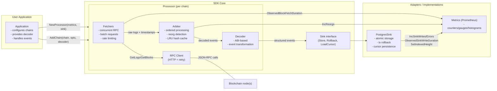

```mermaid
flowchart LR
  subgraph SDKCore["SDK Core"]
    subgraph Processor["Processor (per chain)"]
      F["Fetchers\n- concurrent RPC\n- batch requests\n- rate limiting"]
      A["Arbiter\n- ordered processing\n- reorg detection\n- LRU hash cache"]
      DEC["Decoder\n- ABI-based\n- event transformation"]
      RPC["RPC Client\n(HTTP + retry)"]
      F -->|"GetLogs/GetBlocks"| RPC
    end

    SINK_IF["Sink interface\n(Store, Rollback, LoadCursor)"]
  end

  subgraph Adapters["Adapters / Implementations"]
    PSINK["PostgresSink\n- atomic storage\n- tx rollback\n- cursor persistence"]
    METRICS["Metrics (Prometheus)\n- counters/gauges/histograms"]
  end

  subgraph UserApp["User Application"]
    APP["Application\n- configures chains\n- provides decoder\n- handles events"]
  end

  %% Data flow
  APP -->|"NewProcessor(metrics, sink)"| Processor
  APP -->|"AddChain(chain, opts, decoder)"| Processor
  F -->|"raw logs + timestamps"| A
  A -->|"decoded events"| DEC
  DEC -->|"structured events"| SINK_IF
  SINK_IF --> PSINK

  %% Metrics flow
  F -->|"ObservedBlockFetchDuration"| METRICS
  A -->|"IncReorgs"| METRICS
  PSINK -->|"IncSinkWrites/Errors\nObservedSinkWriteDuration\nSetIndexedHeight"| METRICS

  %% External
  RPC ---|"JSON-RPC calls"| CHAIN["Blockchain node(s)"]
```