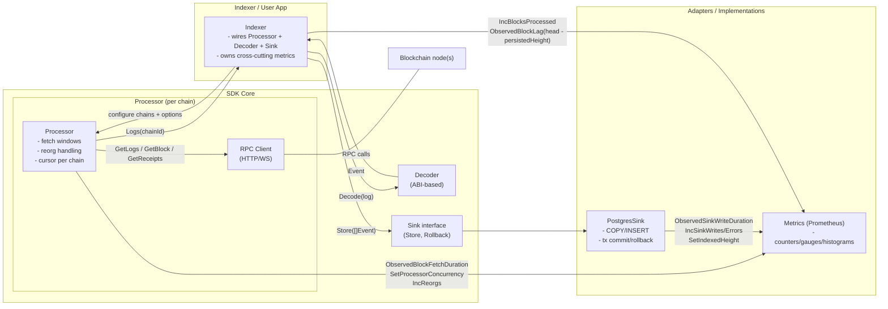

```mermaid
flowchart LR
  subgraph SDKCore["SDK Core"]
    subgraph ProcessorCluster["Processor (per chain)"]
      P["Processor\n- fetch windows\n- reorg handling\n- cursor per chain"]
      RPC["RPC Client\n(HTTP/WS)"]
      P -->|"GetLogs / GetBlock / GetReceipts"| RPC
    end

    D["Decoder\n(ABI-based)"]
    SINK_IF["Sink interface\n(Store, Rollback)"]
  end

  subgraph Adapters["Adapters / Implementations"]
    PSINK["PostgresSink\n- COPY/INSERT\n- tx commit/rollback"]
    METRICS["Metrics (Prometheus)\n- counters/gauges/histograms"]
  end

  subgraph Orchestrator["Indexer / User App"]
    IX["Indexer\n- wires Processor + Decoder + Sink\n- owns cross-cutting metrics"]
  end

  %% Wiring
  IX -->|"configure chains + options"| P
  P -->|"Logs(chainId)"| IX
  IX -->|"Decode(log)"| D
  D -->|"Event"| IX
  IX -->|"Store([]Event)"| SINK_IF
  SINK_IF --> PSINK

  %% Metrics responsibilities
  P -->|"ObservedBlockFetchDuration\nSetProcessorConcurrency\nIncReorgs"| METRICS
  PSINK -->|"ObservedSinkWriteDuration\nIncSinkWrites/Errors\nSetIndexedHeight"| METRICS
  IX -->|"IncBlocksProcessed\nObservedBlockLag(head - persistedHeight)"| METRICS

  %% External
  RPC ---|"RPC calls"| CHAIN["Blockchain node(s)"]
```